# Docker with Node.js

## Description

Docker is a powerful containerization platform that allows developers to build, package, and distribute applications along with their dependencies. Here, we will demonstrate how to use Docker, and how a simple node.js application can be run inside a Docker container.

## Install Docker Desktop

1. Download [Docker](https://www.docker.com/).
   
   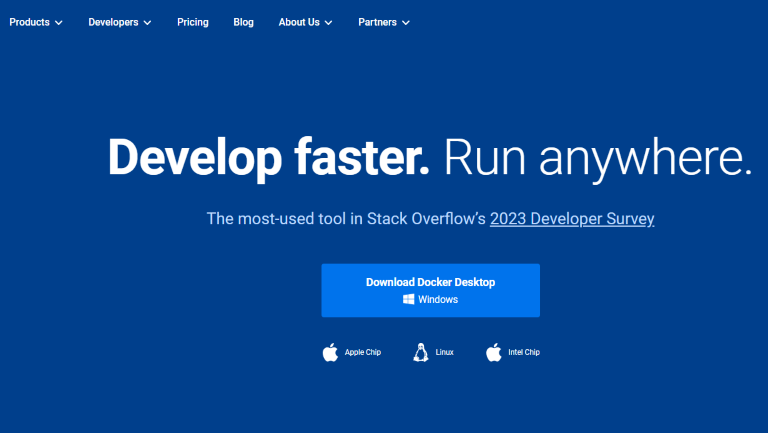

2. Install Docker Desktop.
   
   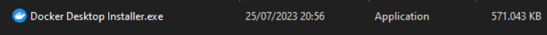

3. Wait until the installation is complete. No specific configuration is required in this installation.
   
4. Verify the installation by running the `docker --version` command on your Terminal.
   
   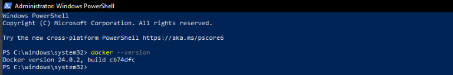

5. In most cases, we need to configure Windows Subsystem for Linux (WSL). Refer to the following page to learn more about Windows Subsystem.

    - [WSL version](https://learn.microsoft.com/en-us/windows/wsl/compare-versions)
    - [WSL documentation](https://learn.microsoft.com/en-us/windows/wsl/)

6. Verify the installation by running the following command on your Terminal.
   
   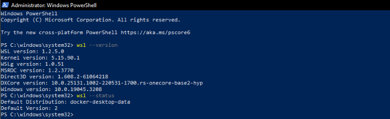

7. Docker is installed. We're good to go.

## Dockerize a simple Node.js application

**Note:** We don't need to install node.js on our machine. What we need to do is use the Dockerfile to build the image, and run the container.

1. Create a directory to store all the required files, then open the IDE to start the operation.
   
2. Prepare the **node.js application**.
   
   - In this project, we use an existing node.js application.
  
     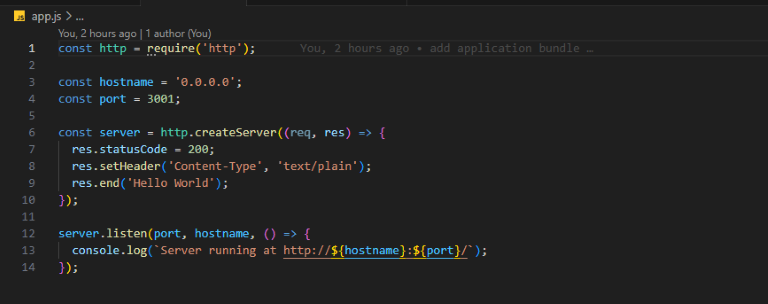

   - Place the file in the directory. 
   
3. Create **package.json**

   - Create a package.json file containing the description of the application.

     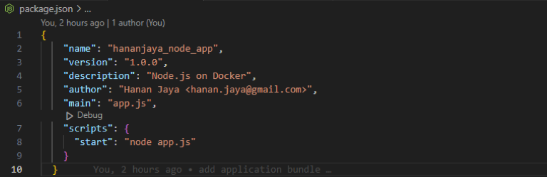

   - Run `npm install`.  If we are using `npm` version 5 or later, this will generate a `package-lock.json` file which will be copied to our Docker image.

4. Create **Dockerfile**
   
   - Dockerfile with the comment explanation on every command can be seen here:
     
     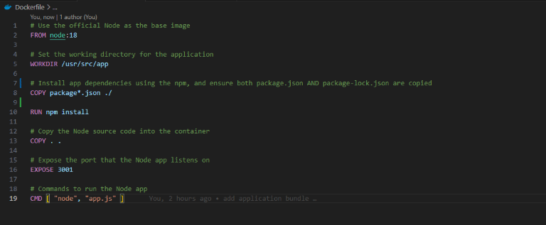

   - All set. The node.js application, the package.json, and the Dockerfile are ready.

5. Build the **Image**

   - Build the image by running the `docker build . -t <app name>` command.
      
     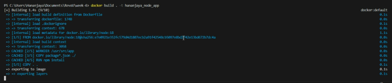

   - Verify the image and make sure it's listed in the docker by running the `docker images` command.
  
     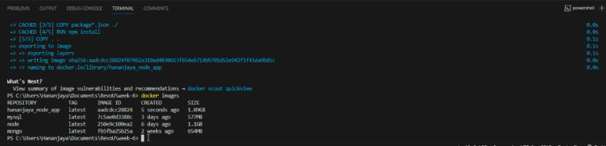

     Result on Docker Desktop.

     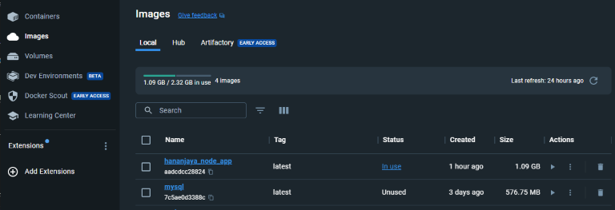

6. Run the **Image**

   - Run the image by running the `docker run <desired port>:<selected port set in app.js and dockerfile> -d <app name>` command.
      
     The command will be: `docker run 3002:3001 -d hananjaya_node_app`.

   - Verify the image and make sure it's running in the container by running the `docker ps` command.
  
     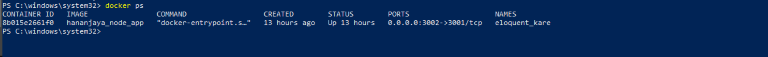

     Result on Docker Desktop.

     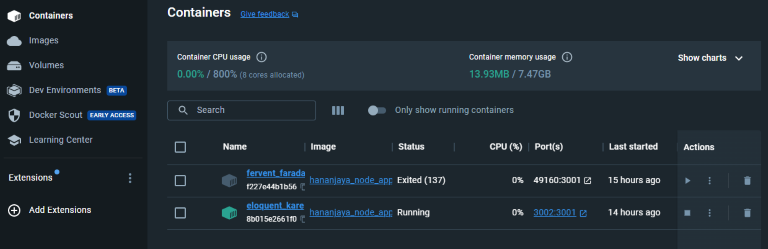

7. Moment of truth
   
   - Open the browser, head to desired port we set before, the complete localhost should be `https://localhost:3002/` 
    
     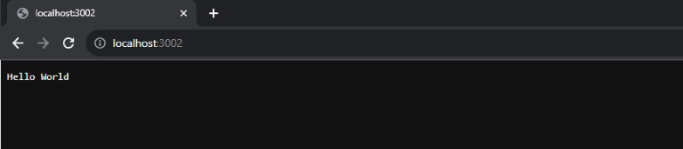

   - Done. Now we are running a simple node.js application inside a Docker container. _Salam luar biasa_
